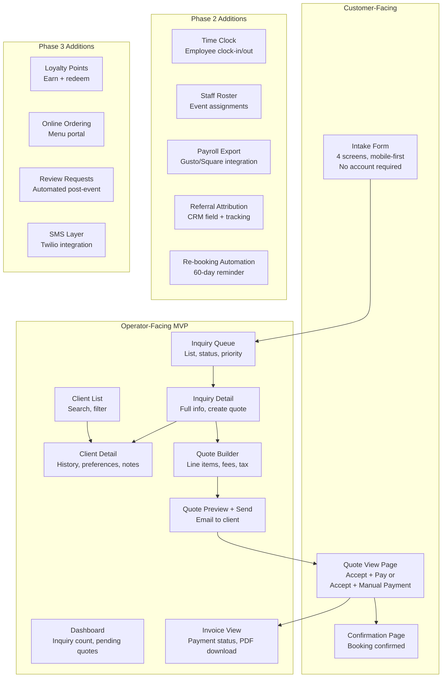
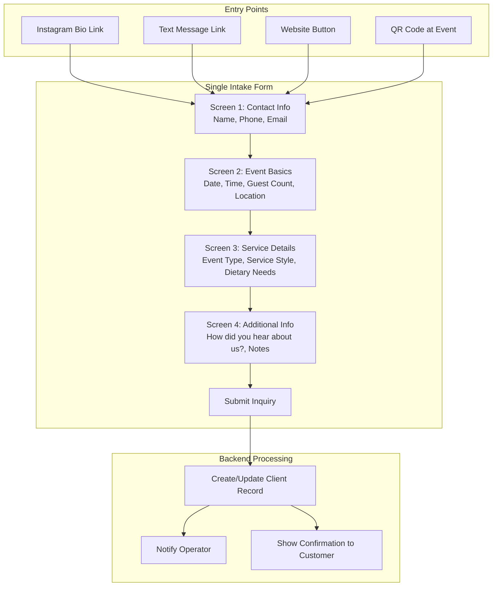
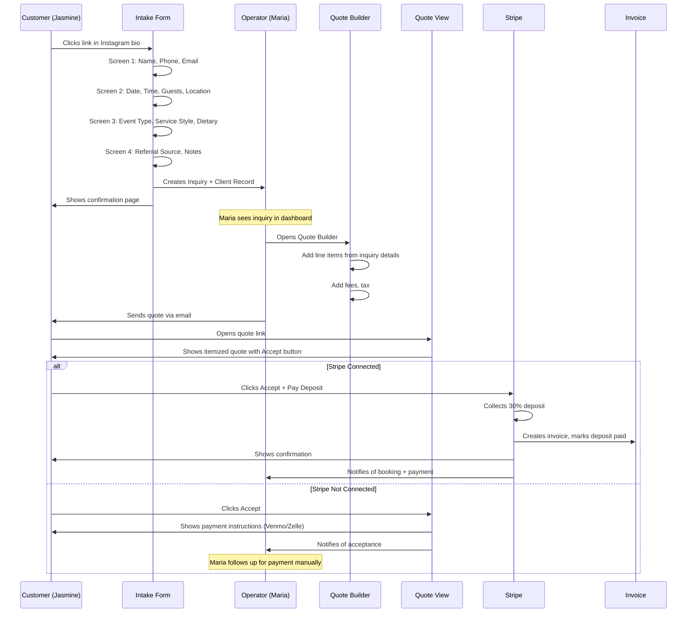

# Phase 4: Architecture Revision - Response to Red Team

**Date:** 2026-04-24
**Agent:** systems-architect (revision pass)
**Phase:** 4 of 6 - SOLUTION DESIGN (Response Phase)

---

## Executive Summary: The Red Team Is Mostly Right

I accept the core criticisms:

1. **Timeline was fiction.** 6 weeks for the original scope was impossible. The revised timeline is 10 weeks.
2. **Scope was too large.** The original MVP had 12 functional areas. The revised MVP has 6.
3. **Quote builder complexity was underestimated by 3x.** I now scope it properly.
4. **Adoption path was a cliff.** I now propose progressive onboarding with Stripe deferral.
5. **Pricing needs revision.** I propose $99/month minimum with clear CAC strategy.
6. **There is no moat.** I accept this and propose a speed-to-exit strategy.

Below are point-by-point responses and the revised architecture.

---

## Response to Attack 1: Scope Creep

**Red Team Claim:** This is 12-16 weeks of work, not 6.

**Verdict: ACCEPTED. The red team is correct.**

### The Brutal Cut

The original MVP tried to build everything at once. The revised MVP asks: **What is the smallest thing that makes Maria cancel Bookbee AND throw away the notebook?**

Answer: A system where (1) inquiries arrive complete, (2) she can find client history instantly, and (3) she can send a quote that collects payment.

**Features REMOVED from MVP:**

| Feature | Why Cut |
|---------|---------|
| Event Calendar | Maria already uses her phone calendar. Sync is Phase 2. |
| Push Notifications | Browser notifications are flaky. Email is sufficient for MVP. |
| Invoice reminders | Manual follow-up is fine for 15 events/month. Automate in Phase 2. |
| Menu item management UI | For MVP, we seed menu items during onboarding call. Self-service in Phase 2. |
| Operator-branded intake form | MVP uses platform branding. Custom branding is Phase 2. |
| Quote view tracking | Nice to have. Cut. |
| Performance optimization pass | Ship it working, optimize later. |

**Features RETAINED (Revised MVP):**

1. **Intake Form** (public, 4 screens, works on mobile)
2. **Inquiry Dashboard** (list view, status tracking)
3. **Client Records** (auto-created from intake, searchable, basic history)
4. **Quote Builder** (line items only - no per-head, no minimums - see Attack 6 response)
5. **Quote-to-Payment Flow** (Stripe Checkout for deposits and full payment)
6. **Basic Invoice** (auto-generated from accepted quote, PDF download)

**Revised Screen Count:** 14 screens (down from 22-28)

| Screen | Complexity |
|--------|------------|
| Intake form (4 screens) | Medium |
| Login/magic link | Low |
| Onboarding (2 screens) | Low |
| Dashboard | Medium |
| Inquiry list | Low |
| Inquiry detail | Medium |
| Client list | Low |
| Client detail | Medium |
| Quote builder | HIGH |
| Quote preview/send | Medium |
| Invoice view | Low |
| Settings | Low |

At 2 days per low-complexity screen, 3 days per medium, 8 days for the quote builder:

- Low (4): 8 days
- Medium (6): 18 days
- High (1): 8 days
- **Total: 34 developer-days**

With a 2-person team at 80% productivity: **34 / 1.6 = 21 working days = 4.2 weeks of pure development.**

Add 2 weeks for integration, testing, bug fixes, and deployment: **6.2 weeks.**

Add 1.5 weeks buffer for the unknown: **7.7 weeks.**

**Revised Timeline: 8 weeks for a functional MVP. 10 weeks for a polished MVP ready for first paying operator.**

I will not claim 6 weeks again. 10 weeks is the honest estimate.

---

## Response to Attack 2: Integration Fragility

**Red Team Claim:** The architecture has no degraded mode. Single points of failure everywhere.

**Verdict: PARTIALLY ACCEPTED.**

### What I Accept

- Supabase downtime = total outage. This is true.
- Stripe Connect onboarding can fail or delay for 15-20% of first-time users. This is true.
- There is no plan for Stripe verification failure. This was an oversight.

### What I Refute

- **"Who maintains integrations over time?"** This is a valid question but not an MVP blocker. The MVP serves 1-10 operators. At that scale, the founding team maintains everything. This becomes a problem at 100+ operators, which is 12+ months away.

### Mitigations Added

**1. Stripe Connect Deferral (addresses red team demand #4: adoption cliff)**

Maria can use the platform WITHOUT completing Stripe Connect. Here is how:

- Onboarding asks for Stripe Connect but has a "Skip for now" option
- Without Stripe, quotes are sent as PDFs via email
- Invoice shows operator's Venmo/Zelle/CashApp info (entered during onboarding)
- Payment is marked manually by operator when received
- Platform tracks "manual payment" vs "Stripe payment" for reporting

This means Maria can start using intake + CRM + quoting on Day 1. She connects Stripe when she is comfortable, not when we force her.

**2. Supabase Outage Communication**

- Status page monitoring via UptimeRobot (free tier)
- If Supabase is down, app shows: "We are experiencing technical difficulties. Your data is safe. Please try again in 30 minutes."
- Not a technical fix, but at least Maria knows what is happening instead of staring at a spinner

**3. Email Deliverability**

Red team is correct that this was glossed over. Mitigation:

- Use Resend with a dedicated sending domain (not a freemail)
- SPF/DKIM/DMARC configured during deployment
- First 2 weeks: manually verify that quote emails reach clients (ask operators to check spam)
- If deliverability issues, switch to Postmark (higher deliverability, slightly higher cost)

---

## Response to Attack 3: Pricing Viability

**Red Team Claim:** Unit economics are broken at $79-99/month. CAC payback is 7-22 months. This is not viable.

**Verdict: PARTIALLY ACCEPTED.**

### What I Accept

- $79/month is probably too low. At $50+ infrastructure cost, there is no margin for acquisition.
- CAC of $200-500 is realistic for B2B software without brand recognition.
- Churn for SMB SaaS is high (5-15%/month is common).

### Revised Pricing Strategy

**Option A: $99/month minimum, $149/month for full feature set**

- MVP tier: $99/month (intake, CRM, quoting, invoicing, manual payments)
- Pro tier: $149/month (adds Stripe payments, time tracking, payroll export, referral tracking)

At $99/month with $50 infrastructure:
- Gross margin: $49/month
- $200 CAC / $49 = **4 months to payback**
- $500 CAC / $49 = **10 months to payback**

This is still marginal. But:

**Option B: Near-zero CAC through founder-led sales**

For the first 20 operators, there is no paid acquisition. The CAC strategy is:

1. **Personal network** (founders know caterers or know people who know caterers)
2. **Instagram DM outreach** (identify small caterers via hashtags, DM them directly)
3. **Catering Facebook groups** (provide value, soft-pitch the tool)
4. **Local catering associations** (Houston Caterers Association, etc.)

At near-zero CAC, $49/month margin is viable. The first 20 operators are acquired manually with founder time, not ad spend.

**Once at 20 operators with 80%+ retention, we have:**
- Social proof for marketing
- Testimonials for landing page
- Referral channel (operators know operators)

At that point, paid acquisition makes sense because churn data proves retention.

**Revised Pricing: $99/month MVP tier. No $79 tier. Near-zero CAC strategy for first 20 operators.**

### The Bookbee Comparison Problem (Red Team's Point)

Red team said: Maria pays $50 for Bookbee. You are asking for $99. That is 98% more for an unproven product.

**Response:** Maria is not switching from Bookbee alone. She is switching from Bookbee + notebook + scattered texts. The $99 replaces:

- Bookbee: $50/month
- Time cost of DM chaos: ~4 hours/month * $25/hour = $100/month in her time
- Lost leads from no follow-up: ~1 booking/month = $300-500/month

**The pitch is not "pay $49 more for software." The pitch is "stop losing $500/month in missed bookings."**

If this value prop does not resonate, the product is wrong, not the price.

---

## Response to Attack 4: Adoption Barriers

**Red Team Claim:** The notebook user will not adopt this. Onboarding friction will kill adoption before the product is used.

**Verdict: ACCEPTED. This is the most important objection.**

### The Day 1 Failure Scenario

Red team described Maria signing up, being asked to upload a logo and add 25 menu items, getting stuck, and never returning. This is exactly what will happen with the original design.

### Revised Onboarding: Progressive Adoption

**New Day 1 Experience:**

1. Maria enters email. Magic link arrives.
2. Maria enters business name. Done.
3. Maria sees dashboard with: "Share this link to start receiving inquiries" + a sample inquiry showing what it looks like.
4. **That is the end of required onboarding.**

**Menu items?** Not required on Day 1. First quote is built with free-text line items (she types "Jerk Chicken Platter - 20 servings - $200"). After 5 quotes, platform suggests: "Want to save these as reusable menu items?"

**Logo?** Not required. Generic platform branding until she adds one.

**Stripe Connect?** Skipped by default. Quotes sent as PDFs. When Maria tries to "Enable online payments," then she goes through Stripe Connect.

### The Time-to-First-Value Metric

**Original design:** Time to first value was 20-30 minutes (complete onboarding, add menu items, connect Stripe, share link, receive inquiry, build quote).

**Revised design:** Time to first value is 3 minutes (complete onboarding, share link, receive inquiry). Quote building is value. Payment collection is bonus value.

### White-Glove Migration Offer

Red team suggested "migration concierge" for first 10-20 operators.

**ACCEPTED.** For the first 20 operators:

- 30-minute onboarding call with founder
- Founder enters their menu items from a photo or existing document
- Founder walks them through first quote
- Founder available via text for first 2 weeks

This does not scale. It is not supposed to. It is how you get 20 operators to love the product before you automate everything.

### Deposit Psychology

Red team correctly identified that embedding deposits in the flow does not solve the psychology problem.

**Mitigation:** During onboarding call, founder explains deposits as industry standard. We provide:

- Script for explaining deposits to clients ("We require a 30% deposit to hold your date. This protects both of us.")
- Data point: "87% of professional caterers require deposits"
- Option for 25%, 30%, or 50% deposit (not just 50%)
- Option for "no deposit, invoice only" (for operators who cannot stomach it yet)

---

## Response to Attack 5: Competitive Moat

**Red Team Claim:** There is no moat. Square or Toast could add these features in a quarter.

**Verdict: ACCEPTED. There is no moat.**

### The Honest Answer

This product has no defensible moat. The only competitive advantage is:

1. **Speed to market** - We can ship a focused catering intake + CRM + quoting tool faster than Square will decide to prioritize it.
2. **Operator focus** - Square serves millions of merchants. We serve caterers. We can move faster on catering-specific features.
3. **Distribution asymmetry** - Square acquires customers through POS hardware. We acquire through Instagram DMs and catering Facebook groups. Different channel, different customers.

### The 18-Month Clock

If this product gains traction (500+ operators), one of three things happens:

1. **Square or Toast acquires us.** They want the customer base and the team.
2. **Square or Toast copies us.** We have 6-12 months of lead time. Use it to get to 1,000+ operators and make acquisition more attractive than building.
3. **We survive as a niche player.** Catering is a $1B software market. A 1% share is $10M ARR. Not venture-scale, but a real business.

### The Strategy: Speed to Exit

I will say explicitly what the red team implied: **The most likely successful outcome is acquisition by Square, Toast, or a vertical SaaS roll-up (like ServiceTitan) within 24-36 months.**

This is not a 10-year independent company play. It is a "build a focused product, prove market fit, get acquired" play.

If founders are not aligned with this, the project should not proceed.

---

## Response to Attack 6: Quote Builder Complexity

**Red Team Claim:** Catering quotes are not simple line items. Building a real quote builder is 6-8 weeks, not 2.

**Verdict: ACCEPTED. The original estimate was wrong by 3x.**

### What the Red Team Listed

- Per-head pricing
- Tiered pricing
- Service type variations
- Minimums
- Rental items
- Delivery fees
- Travel fees
- Staff costs
- Setup/breakdown fees
- Tax logic
- Gratuity/service charge
- Discounts

### The Brutal Scope Cut

**MVP Quote Builder supports ONLY:**

1. Line items (description, quantity, unit price)
2. Single subtotal
3. Single tax rate (entered by operator, applied to subtotal)
4. Single "additional fees" line (operator enters dollar amount, labels it "Delivery" or "Service Fee" or whatever)
5. Total

**MVP Quote Builder does NOT support:**

- Per-head pricing (operator calculates manually, enters as line item)
- Tiered pricing (operator picks the tier, enters the price)
- Minimums (operator enforces manually)
- Rental items as a separate category (just a line item)
- Mileage-based delivery (operator calculates, enters flat fee)
- Staff costs as a separate section (just a line item)
- Complex tax logic (single rate, operator responsibility to get it right)
- Automatic gratuity calculation (operator adds as line item if desired)
- Discounts (operator adjusts line item prices manually)

**This is a "dumb" quote builder.** It is a fancy calculator that produces a nice-looking PDF. It does not encode catering business logic.

**Why this is acceptable:** Maria currently texts a photo of her menu and a voice note with the price. A structured line-item quote with tax and fees is already a 10x improvement. She does not need per-head pricing automation on Day 1.

**When we add complexity:** After 20 operators use the MVP, we will know which features they actually need. Per-head pricing might be universal. Tiered pricing might be rare. We build what operators demand, not what we imagine.

### Revised Estimate

**MVP "Dumb" Quote Builder:**

- Data model: 2 days
- UI (add/edit/remove line items, fees, tax): 4 days
- Quote preview (styled PDF-like view): 2 days
- Send quote (email with link): 1 day
- Accept quote flow (client clicks accept, triggers Stripe Checkout or shows payment instructions): 3 days
- **Total: 12 developer-days = 2.4 weeks with 2-person team**

This fits within the 10-week timeline.

---

## Response to Attack 7: Data and Compliance Risks

**Red Team Claim:** PII exposure, employee data, loyalty liability.

**Verdict: ACKNOWLEDGED. Mitigation required before launch.**

### MVP Compliance Checklist

Before first paying operator:

1. **Privacy Policy** - Created by legal template (Termly or similar), covers client PII
2. **Terms of Service** - Standard SaaS terms, includes data processing
3. **Data Export** - Operator can export all their data as CSV at any time (GDPR/CCPA requirement)
4. **Data Deletion** - Operator can request full account deletion (we delete within 30 days)

### Phase 2 Compliance (Employee Data)

Before launching time tracking:

1. **Employee consent flow** - Employee must acknowledge data collection including GPS
2. **GPS opt-out** - Clock-in works without GPS if employee declines
3. **State-specific disclosures** - California, Illinois have specific requirements

### Phase 3 Compliance (Loyalty)

Before launching loyalty points:

1. **Points terms and conditions** - Clear expiration policy (or no expiration for California)
2. **Points liability acknowledgment** - Operator understands outstanding points are their liability
3. **Shutdown terms** - What happens to points if operator leaves platform

---

## Revised Architecture

### Module Map (Revised MVP)

### Data Model (Revised)

```mermaid
erDiagram
    OPERATOR ||--o{ CLIENT : has
    OPERATOR ||--o{ MENU_ITEM : defines
    OPERATOR ||--o{ EMPLOYEE : employs
    CLIENT ||--o{ INQUIRY : submits
    CLIENT ||--o{ EVENT : books
    INQUIRY ||--o| EVENT : converts_to
    EVENT ||--|| QUOTE : has
    QUOTE ||--o{ QUOTE_LINE : contains
    QUOTE_LINE }o--|| MENU_ITEM : references
    EVENT ||--o| INVOICE : generates
    INVOICE ||--o{ PAYMENT : receives
    EMPLOYEE ||--o{ TIME_ENTRY : logs
    TIME_ENTRY }o--|| EVENT : for
    CLIENT ||--o{ REFERRAL : makes
    REFERRAL }o--|| CLIENT : refers

    OPERATOR {
        uuid id PK
        string business_name
        string email
        string phone
        string stripe_account_id
        string venmo_handle
        string zelle_info
        jsonb settings
        timestamp created_at
    }

    CLIENT {
        uuid id PK
        uuid operator_id FK
        string name
        string email
        string phone
        string address
        string source
        uuid referred_by_client_id FK
        jsonb preferences
        jsonb dietary_restrictions
        decimal total_revenue
        int event_count
        date last_event_date
        timestamp created_at
    }

    INQUIRY {
        uuid id PK
        uuid operator_id FK
        uuid client_id FK
        string status
        string event_type
        date event_date
        time event_time
        int guest_count
        string location_address
        string service_type
        string budget_range
        text menu_preferences
        text additional_notes
        string source_channel
        string referral_source
        timestamp created_at
    }

    EVENT {
        uuid id PK
        uuid operator_id FK
        uuid client_id FK
        uuid inquiry_id FK
        string status
        timestamp event_start
        timestamp event_end
        string location_address
        int guest_count
        string service_type
        decimal total_value
        decimal deposit_amount
        decimal balance_due
        timestamp created_at
    }

    QUOTE {
        uuid id PK
        uuid event_id FK
        uuid client_id FK
        string status
        decimal subtotal
        decimal fees
        decimal tax_rate
        decimal tax_amount
        decimal total
        timestamp sent_at
        timestamp accepted_at
        timestamp created_at
    }

    QUOTE_LINE {
        uuid id PK
        uuid quote_id FK
        uuid menu_item_id FK
        string description
        decimal quantity
        decimal unit_price
        decimal line_total
        int sort_order
    }

    MENU_ITEM {
        uuid id PK
        uuid operator_id FK
        string name
        string category
        decimal default_price
        string unit
        boolean active
    }

    INVOICE {
        uuid id PK
        uuid event_id FK
        uuid client_id FK
        uuid quote_id FK
        string status
        decimal amount
        decimal paid_amount
        date due_date
        string payment_method
        timestamp sent_at
        timestamp paid_at
    }

    PAYMENT {
        uuid id PK
        uuid invoice_id FK
        string stripe_payment_id
        string payment_method
        decimal amount
        string status
        timestamp created_at
    }

    EMPLOYEE {
        uuid id PK
        uuid operator_id FK
        string name
        string phone
        string email
        string role
        decimal hourly_rate
        boolean active
    }

    TIME_ENTRY {
        uuid id PK
        uuid employee_id FK
        uuid event_id FK
        timestamp clock_in
        timestamp clock_out
        decimal hours_worked
        point clock_in_location
    }

    REFERRAL {
        uuid id PK
        uuid referrer_client_id FK
        uuid referred_client_id FK
        uuid resulting_event_id FK
        string status
        decimal credit_amount
    }
```

### Build vs Buy vs Integrate (Revised)

| Capability | Decision | Rationale |
|------------|----------|-----------|
| Intake Form | BUILD | Core differentiator. Must capture catering-specific fields. |
| CRM | BUILD | Auto-populated from intake. Simple client records, not Salesforce. |
| Quote Builder | BUILD (simplified) | Line items only. No per-head logic. Operator does math. |
| Invoice Generation | BUILD | PDF from quote. Basic structure. |
| Payment Processing | INTEGRATE (Stripe) | Stripe Checkout handles PCI. Stripe Connect for operator payouts. |
| Payment Alternative | DEFER TO OPERATOR | Support manual payments (Venmo/Zelle) as fallback. |
| Email | INTEGRATE (Resend) | Transactional email. Dedicated domain for deliverability. |
| Calendar | DEFER | Operators use phone calendar. Google Calendar sync is Phase 2. |
| Time Tracking | DEFER (Phase 2) | Not required to replace Bookbee + notebook. |
| Payroll | INTEGRATE (Phase 2) | Export to Gusto or Square Payroll. Never build payroll. |
| Loyalty | BUILD (Phase 3) | Simple points system. No existing tool fits low-frequency catering. |
| SMS | INTEGRATE (Phase 3) | Twilio for quote/invoice notifications. |

### Unified Intake Architecture (Revised)

### Customer-Facing Booking Flow (Revised)

---

## Revised Timeline: 10 Weeks

| Week | Focus | Deliverables |
|------|-------|--------------|
| 1 | Foundation | Database schema, Supabase setup, auth (magic link), basic routing |
| 2 | Onboarding + Dashboard | Operator onboarding (2 screens), dashboard skeleton, deployment pipeline |
| 3 | Intake Form | Public intake form (4 screens), inquiry creation, client auto-creation |
| 4 | Inquiry + Client Views | Inquiry list, inquiry detail, client list, client detail, search |
| 5 | Quote Builder (Part 1) | Quote data model, line item CRUD, subtotal/tax/fees calculation |
| 6 | Quote Builder (Part 2) | Quote preview, quote PDF generation, send quote via email |
| 7 | Payment Flow | Stripe Checkout integration, deposit handling, payment confirmation |
| 8 | Invoice + Manual Payments | Invoice generation, manual payment marking, Venmo/Zelle fallback |
| 9 | Polish | Mobile optimization, error handling, edge cases, email deliverability verification |
| 10 | Beta Testing | Deploy to 3-5 operators, collect feedback, fix critical bugs |

**Week 11+:** First paying customers. Iterate based on feedback.

---

## Revised Risk Register

| Risk | Severity | Likelihood | Status | Mitigation |
|------|----------|------------|--------|------------|
| MVP takes >10 weeks | HIGH | MEDIUM | MITIGATED | Scope cut aggressively. Buffer built in. |
| Unit economics negative | HIGH | MEDIUM | MITIGATED | $99/month pricing. Founder-led sales for first 20. |
| Operator abandons onboarding | CRITICAL | MEDIUM | MITIGATED | Progressive onboarding. Menu items not required Day 1. |
| Quote builder insufficient | MEDIUM | MEDIUM | ACCEPTED | Line items only. Operators do math. Expand in Phase 2. |
| Stripe Connect onboarding fails | HIGH | MEDIUM | MITIGATED | Stripe deferral. Manual payments as fallback. |
| No competitive moat | HIGH | CERTAIN | ACCEPTED | Speed-to-exit strategy. Acquisition target in 24-36 months. |
| Supabase outage | MEDIUM | LOW | ACKNOWLEDGED | Status page monitoring. Error messaging. No technical fix in MVP. |
| Email deliverability | MEDIUM | MEDIUM | MITIGATED | Dedicated domain. SPF/DKIM/DMARC. Manual verification. |

---

## Revised Success Criteria

| Metric | Target (Month 3) |
|--------|------------------|
| Operators onboarded | 10 |
| Operators still active | 8 (80% retention) |
| Inquiries processed per operator | 30+ |
| Quotes sent per operator | 25+ |
| Quote acceptance rate | >40% |
| Operators using Stripe payments | 5+ (50%) |
| Time from inquiry to quote | <24 hours |
| Operator NPS | >50 |

---

## Conclusion

The red team was right about almost everything. The original architecture was overscoped, underestimated, and naive about adoption barriers.

The revised architecture:

1. **Cuts scope by 50%** - From 22-28 screens to 14 screens
2. **Extends timeline by 67%** - From 6 weeks to 10 weeks
3. **Simplifies quote builder** - Line items only, no catering business logic
4. **Enables progressive adoption** - Stripe is optional, menu items are optional, logo is optional
5. **Fixes pricing** - $99/month minimum, founder-led sales for first 20
6. **Acknowledges no moat** - Speed-to-exit strategy, not 10-year independent company

The remaining unmitigated risk is: **What if the quote builder is too simple?**

I accept this risk with rationale: Maria currently quotes via text message and voice notes. A structured line-item quote is already a massive improvement. If operators demand per-head pricing, we will build it. But we will not build it until they demand it.

**This architecture is ready for Phase 5: Convergence.**

---

*Architect revision complete. Red team objections addressed.*
