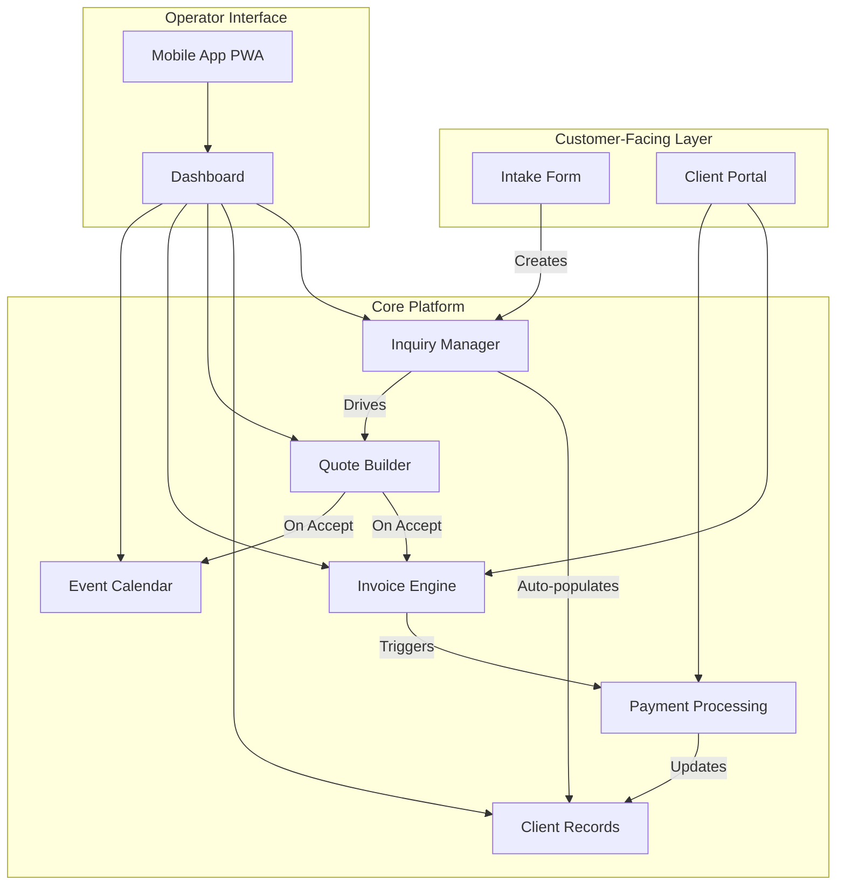
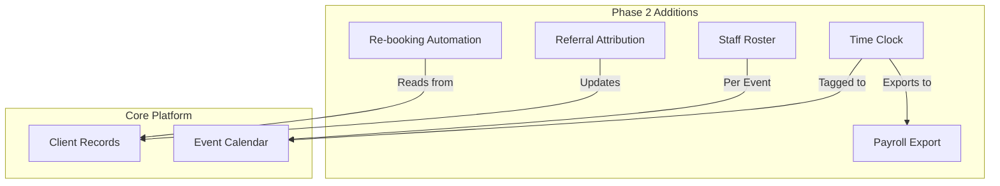
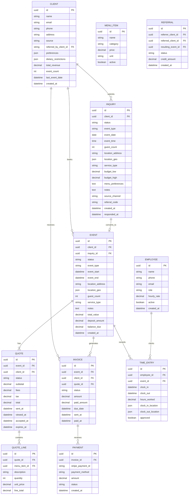
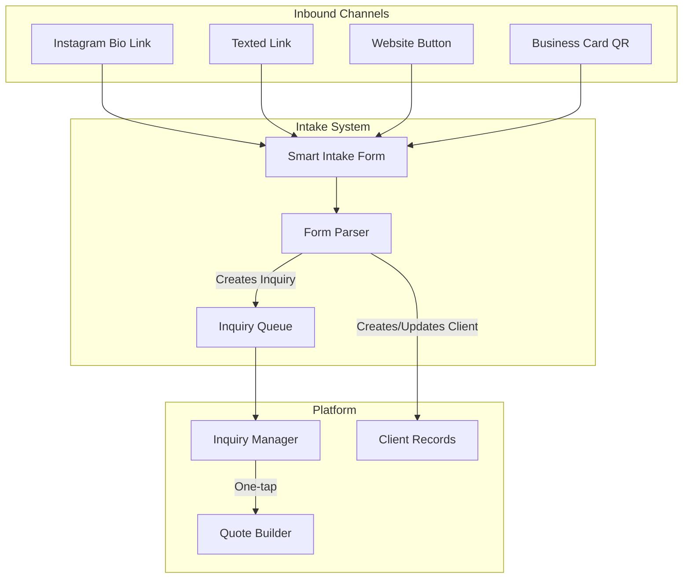
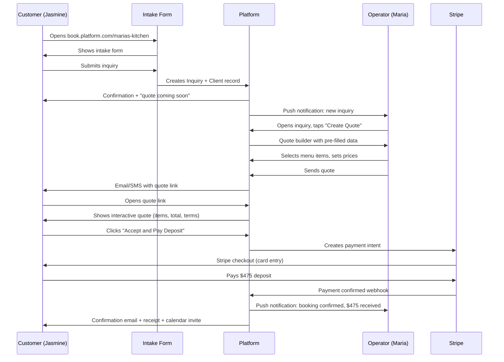
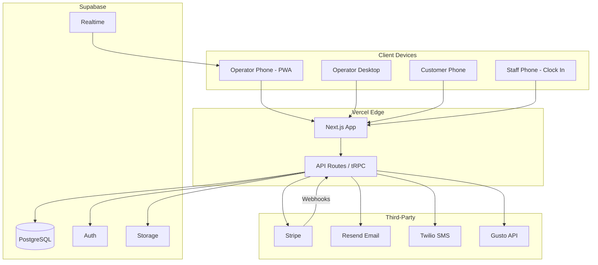
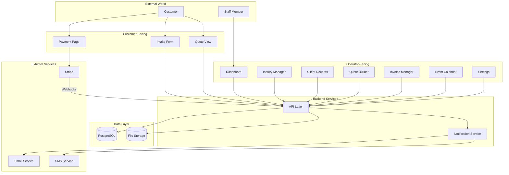
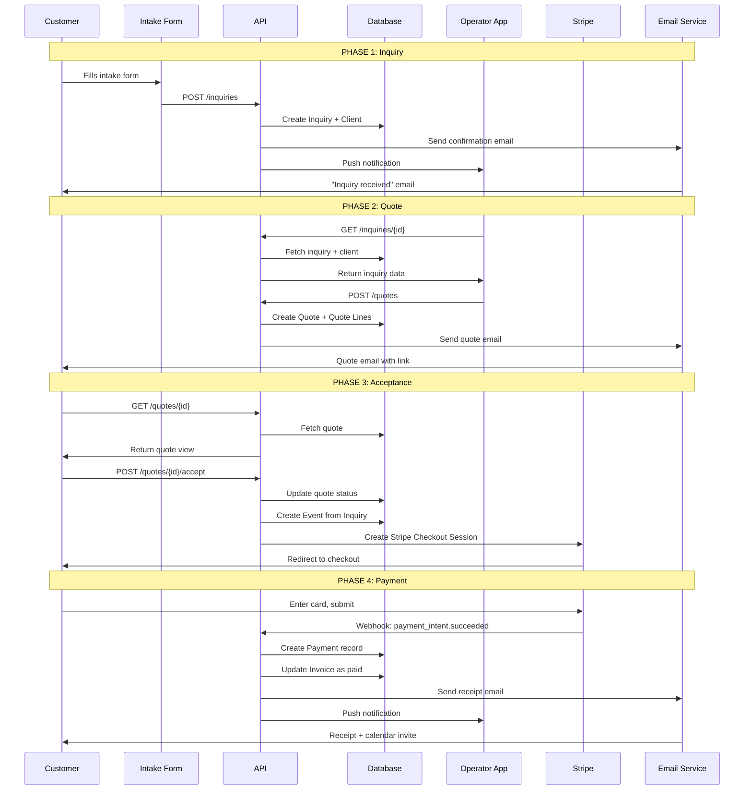
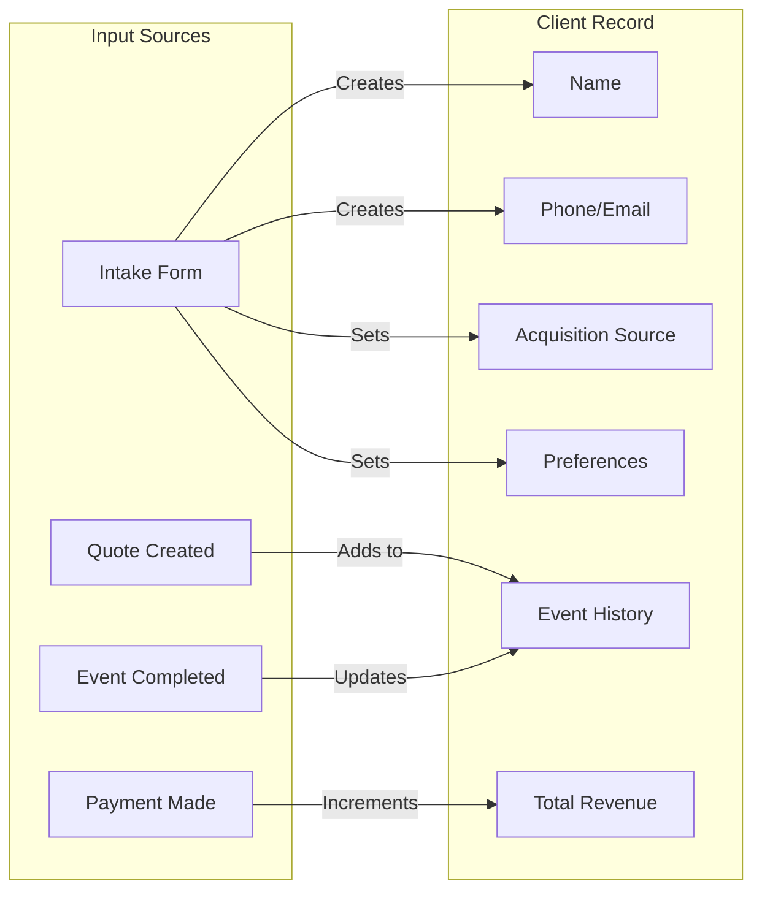

# Phase 4: Solution Architecture

**Date:** 2026-04-24
**Agent:** systems-architect
**Phase:** 4 of 6 - SOLUTION DESIGN

---

## Executive Summary

This architecture delivers the "excellent version of 3 tools, not mediocre version of 9" directive from Phase 1. The platform replaces:

1. **Bookbee** (quoting, invoicing, payments) - $50/month
2. **The Notebook** (CRM, client history) - priceless chaos
3. **Scattered Texts/DMs** (inquiry intake) - lost leads worth $2,000-3,000/month

The design is mobile-first, operator-simple, and extensible for Phase 2 features (time tracking, loyalty, payroll export) without rewriting the core.

---

## Part 1: Platform Module Map

### Core Modules (MVP - Weeks 1-6)



### Module Boundaries and Responsibilities

| Module | Responsibility | Does NOT Do |
|--------|---------------|-------------|
| **Intake Form** | Capture structured inquiry data from any channel | Parse unstructured text/DMs |
| **Inquiry Manager** | Queue, prioritize, track status of inquiries | Marketing automation |
| **Client Records (CRM)** | Store client data, history, preferences, source attribution | Complex segmentation |
| **Quote Builder** | Create itemized quotes from menu items, send to client | Menu/recipe costing |
| **Invoice Engine** | Generate invoices from quotes, track payment status | Accounting integration |
| **Payment Processing** | Collect deposits and balances via Stripe | Split payments, financing |
| **Event Calendar** | Display confirmed bookings with all details | Staff scheduling |
| **Dashboard** | Unified view of inquiries, events, revenue | Advanced analytics |

### Phase 2 Modules (Months 2-4)



### Phase 3 Modules (Months 4-8) - Not Designed Yet

- Loyalty Points Engine
- Online Menu/Ordering Portal
- Review Request Automation
- SMS Integration Layer

---

## Part 2: Data Model

### Core Entities



### Key Design Decisions

**1. Client as the anchor entity**
- Every interaction (inquiry, event, invoice) ties to a Client record
- Source attribution stored on Client for "how did you hear about us" reporting
- `total_revenue` and `event_count` are denormalized for fast "who are my top clients" queries

**2. Inquiry-to-Event conversion**
- Inquiry is a separate entity, not a status on Event
- Allows tracking conversion rates: how many inquiries become bookings?
- Preserves full inquiry data even if event is cancelled

**3. Quote as a versioned document**
- Multiple quotes can exist per event (client asks for revisions)
- Quote lines reference Menu Items but store price at time of quote (prices change)
- `viewed_at` enables "has the client seen this?" follow-up triggers

**4. Time entries tagged to events**
- Not just clock-in/clock-out for the day
- Tagged to specific Event ID for "how many hours did this event cost me?" reporting
- Enables payroll export grouped by pay period with event context

**5. Referral as explicit relationship**
- Not a field on Client, but a first-class entity
- Allows tracking the chain: Client A referred Client B, whose event generated $1,200
- Enables future loyalty credit mechanics without schema changes

### Minimal Viable Schema (MVP)

For the 6-week MVP, we implement:

| Entity | MVP? | Notes |
|--------|------|-------|
| Client | Yes | Core |
| Inquiry | Yes | Core |
| Event | Yes | Core |
| Quote | Yes | Core |
| Quote_Line | Yes | Core |
| Menu_Item | Yes | Minimal (name, price) |
| Invoice | Yes | Core |
| Payment | Yes | Core |
| Employee | Phase 2 | Time tracking dependency |
| Time_Entry | Phase 2 | Time tracking dependency |
| Referral | Phase 2 | Tracking only, no credits yet |

---

## Part 3: Build vs Buy vs Integrate Decisions

### Decision Framework

For each capability, we evaluate:
- **Build cost** (development time, ongoing maintenance)
- **Buy cost** (monthly SaaS fees, per-transaction fees)
- **Integrate cost** (API complexity, vendor lock-in, data ownership)
- **Operator impact** (additional logins, learning curve, friction)

### Decision Matrix

| Capability | Decision | Rationale |
|------------|----------|-----------|
| **Unified Intake** | BUILD | Core differentiator. No existing tool captures catering-specific fields (headcount, service type, dietary) AND works as a single shareable link. Typeform + Zapier = $49/mo + brittle. Own it. |
| **CRM / Client Records** | BUILD | Must be auto-populated from intake. HubSpot/Salesforce are overkill and expensive. The "notebook replacement" must be seamless - no separate login. |
| **Quoting** | BUILD | Catering quotes have line items (menu + headcount), acceptance workflow, and deposit triggering. Generic proposal tools (PandaDoc, HoneyBook) add $49-129/mo and require data sync. Own the quote-to-payment flow. |
| **Invoicing** | BUILD | Invoices auto-generate from quotes. No manual re-entry. Must support line items for corporate clients (Christine persona). Integrating with QuickBooks is Phase 3 - MVP invoices live in-platform. |
| **Payments** | INTEGRATE (Stripe) | Never build payments. Stripe handles PCI compliance, fraud, disputes. Payment processing at 2.9% + $0.30. Stripe Connect enables future marketplace model. Stripe invoicing API handles reminders. |
| **Event Calendar** | BUILD | Simple calendar view of confirmed events. Must show full event details in one tap. Google Calendar sync is Phase 2 - MVP calendar is internal only. |
| **Time Tracking** | BUILD (Phase 2) | Must be tagged to events - no existing time tracking tool does this. Homebase is $25/mo/location but does not connect hours to catering events. Build a simple clock-in/out tied to Event ID. |
| **Payroll Processing** | INTEGRATE (Gusto API or Square Payroll) | Never build payroll. Regulatory minefield (tax withholding, W-2s, state compliance). Gusto Embedded API or Square Payroll API. Export hours from platform, payroll runs in Gusto/Square. |
| **Loyalty Points** | BUILD (Phase 3) | Simple point-per-dollar model. Existing loyalty tools (Stamp Me, LoyaltyLion) are designed for high-frequency retail, not catering. Build when we have usage data to inform mechanics. |
| **Referral Tracking** | BUILD (Phase 2) | A CRM field + shareable referral link + attribution report. Not a complex marketing platform. ReferralCandy charges 3.5% commission - absurd for a catering booking. Simple build. |
| **SMS Integration** | INTEGRATE (Twilio) | For "customer texts, gets intake link back automatically." Twilio programmable SMS at $0.0079/message. Phase 3 feature. |
| **Email Sending** | INTEGRATE (SendGrid or Postmark) | Transactional emails (quotes, invoices, reminders). SendGrid free tier covers 100 emails/day. No need to build email infrastructure. |
| **Authentication** | INTEGRATE (Clerk or Auth0) | Operator login, staff login (Phase 2). Do not build auth. Clerk free tier covers 10,000 MAUs. |

### Cost Summary: Build vs Buy

**If we integrated existing SaaS tools:**
- HoneyBook (CRM + proposals): $59/month
- Typeform (intake forms): $25/month
- Stripe (payments): 2.9% + $0.30 per transaction
- Homebase (time tracking): $25/month
- Gusto (payroll): $80/month base
- **Total: $189/month + payment processing fees**

**With our platform:**
- Platform subscription: $79-99/month
- Stripe processing: 2.9% + $0.30 per transaction (pass-through)
- Gusto (optional payroll export): $80/month (operator pays directly)
- **Total: $79-99/month + optional $80 for payroll**

The operator saves $90+/month immediately AND gets a unified system instead of 5 disconnected tools.

---

## Part 4: Unified Intake Architecture

### The Problem

Phase 3 identified multi-channel inquiry chaos as Pain Point #1 (Severity 10/10, Daily frequency). Inquiries arrive via:
- Instagram DMs
- Text messages to operator's personal phone
- Bookbee booking link
- Word-of-mouth phone calls
- Website contact forms

Each channel requires manual transcription into the notebook. 3-4 days of back-and-forth before the operator has enough information to quote.

### The Solution: Single Link, Multiple Channels



### Intake Form Design

**URL Structure:** `book.platform.com/[operator-slug]`

Example: `book.platform.com/marias-kitchen`

This single link goes in:
- Instagram bio
- Text reply to "do you cater?"
- Website "Book Now" button
- QR code on business cards

**Form Fields (Progressive Disclosure)**

Screen 1: The Basics
- Your name (required)
- Phone number (required)
- Email (optional - many customers prefer text)
- Event type (dropdown: Birthday, Wedding, Corporate, Graduation, Other)

Screen 2: Event Details
- Event date (date picker)
- Event time (time picker)
- Guest count (number input)
- Location (address with autocomplete or "TBD")

Screen 3: The Menu
- Service type (dropdown: Drop-off, Full Service, Food Truck)
- Menu preferences (multi-select from operator's menu categories)
- Dietary restrictions (checkboxes: Vegetarian, Vegan, Gluten-free, Halal, Kosher, None)
- Budget range (slider: $500-$1000, $1000-$2000, etc.)

Screen 4: Final
- How did you hear about us? (dropdown: Instagram, Referral, Google, Repeat Customer, Other)
- Anything else we should know? (text area)
- Submit

**Total fields: 12** (8 required, 4 optional)
**Target completion time: Under 3 minutes on mobile**

### Auto-Response Flow

1. Customer submits form
2. Platform creates Inquiry record with all data
3. Platform creates or matches Client record (by phone or email)
4. Customer sees confirmation: "Thanks! [Maria] will send you a custom quote within 24 hours."
5. Customer receives email/text (their preference): "Your inquiry for [event type] on [date] has been received. Quote coming soon."
6. Operator receives push notification: "New inquiry - [Name] - [Event Type] - [Date] - [Guest Count]"

### Operator View: Inquiry Card

When Maria opens the app, she sees:

```
NEW INQUIRY
--------------------
Jasmine Rodriguez
Birthday Party | Aug 12, 2026 | 35 guests
Katy, TX | Full Service
Budget: $800-$1000
Source: Instagram

Menu Preferences: Caribbean, Jerk Chicken
Dietary: None noted
Note: "Sister's 40th birthday, outdoor backyard"

[CREATE QUOTE]  [MESSAGE CLIENT]
```

One tap on "Create Quote" opens the Quote Builder with all fields pre-filled.

### Handling "I Just Text" Customers (Marcus Persona)

For repeat customers who text directly (will not fill out a form):

1. Operator receives text from Marcus: "Need lunch for 40 on May 15, same as last time"
2. Operator opens platform, searches "Marcus"
3. Sees past event: "38 guests, BBQ, no pork, 1247 Peachtree St"
4. Taps "Quick Re-book"
5. Platform creates new Inquiry pre-filled from past event
6. Operator adjusts guest count to 40, confirms date
7. Sends quote to Marcus via SMS (platform-generated message with payment link)

Marcus never fills out a form. He texts. He pays. Devon never loses his details.

---

## Part 5: Customer-Facing Booking Flow

### The Journey: Menu to Payment



### Quote Page Design (Client View)

URL: `platform.com/quote/[quote-id]` (no login required, secure token)

```
MARIA'S KITCHEN
Quote for Jasmine Rodriguez
Birthday Party | August 12, 2026

------------------------------------
MENU
------------------------------------
Jerk Chicken (35 servings)      $420
Rice and Peas (35 servings)     $105
Coleslaw (35 servings)           $70
Fried Plantains (35 servings)    $35
------------------------------------
Subtotal                        $630
Full Service Fee                $150
Travel (Katy, TX)               $120
------------------------------------
TOTAL                           $900

------------------------------------
TERMS
------------------------------------
- 50% deposit ($450) required to confirm
- Remaining balance due day of event
- Cancellation within 14 days forfeits deposit
- Includes setup, serving (2 hours), breakdown

------------------------------------
[ACCEPT AND PAY DEPOSIT - $450]
------------------------------------
```

### Post-Booking: What the Customer Sees

**Confirmation Email:**
- Event summary (date, time, location, menu)
- Deposit receipt
- "Add to Calendar" button (generates .ics)
- Link to Client Portal (Phase 2)

**Client Portal (Phase 2):**
- View event details
- See remaining balance
- Pay balance online
- Message the caterer
- Re-book for future events

---

## Part 6: Tech Stack Recommendation

### Constraints

1. **Mobile-first:** Operators use phones. Must work flawlessly on mobile Safari and Chrome Android.
2. **Budget:** MVP in 6 weeks with a small team. No expensive infrastructure.
3. **Speed:** Fast load times on poor cellular connections (event sites, kitchens).
4. **Simplicity:** Small team must be able to maintain and extend.

### Recommended Stack

| Layer | Choice | Rationale |
|-------|--------|-----------|
| **Frontend** | Next.js 14 (App Router) | React ecosystem, server components for fast initial load, Vercel deployment, mobile-responsive by default |
| **Mobile** | PWA (Progressive Web App) | No app store approval needed, installable on home screen, works offline for time clock. Native app is Phase 3. |
| **Backend** | Next.js API Routes + tRPC | Type-safe API, co-located with frontend, fast development |
| **Database** | PostgreSQL (Supabase) | Relational data model fits our entities, Supabase provides hosted Postgres + auth + realtime |
| **Auth** | Supabase Auth (or Clerk) | Built-in with Supabase, supports magic link (no password), role-based access |
| **Payments** | Stripe | Industry standard, excellent API, Stripe Checkout for PCI compliance, Stripe Invoicing API |
| **File Storage** | Supabase Storage (or Cloudflare R2) | For menu item images, contract PDFs |
| **Email** | Resend or Postmark | Transactional email, high deliverability, simple API |
| **SMS** | Twilio (Phase 2) | For quote/invoice notifications to customers who prefer text |
| **Hosting** | Vercel | Zero-config deployment for Next.js, edge functions, automatic scaling |
| **Monitoring** | Sentry | Error tracking, performance monitoring |

### Architecture Diagram



### Cost Estimate (Monthly at MVP Scale)

Assuming: 1 operator, 50 events/month, 200 client records, 500 emails/month

| Service | Cost |
|---------|------|
| Vercel (Pro) | $20/month |
| Supabase (Pro) | $25/month |
| Stripe | 2.9% + $0.30 per transaction (pass-through to operator) |
| Resend | Free tier (3,000 emails/month) |
| Domain | $15/year |
| **Total Infrastructure** | **~$50/month** |

At $79-99/month subscription price per operator, unit economics are healthy from Day 1.

---

## Part 7: Security and Compliance

### Data Protection

- All data encrypted at rest (Supabase default)
- All traffic over HTTPS (Vercel default)
- Database access via row-level security (Supabase RLS)
- Operator can only see their own clients, events, invoices

### Payment Security

- Never touch raw card numbers
- Stripe Checkout handles PCI-DSS compliance
- Payment tokens, not card data, stored in our database

### Access Control

| Role | Permissions |
|------|-------------|
| Operator (Owner) | Full access to all data, settings, team management |
| Operator (Staff) | View events, clock in/out (Phase 2), cannot see revenue |
| Customer | View/pay own quotes and invoices only (via secure link, no login) |

### Data Retention

- Client data retained indefinitely (CRM value)
- Payment records retained per Stripe (7 years)
- Time entries retained for 2 years (payroll compliance)
- Operator can export all data (GDPR/CCPA requirement)

---

## Part 8: MVP Feature Scope (6 Weeks)

### Week 1-2: Foundation
- [ ] Database schema (Client, Inquiry, Event, Quote, Invoice, Payment)
- [ ] Operator authentication (magic link, no password)
- [ ] Operator onboarding (business name, logo, menu items)
- [ ] Dashboard skeleton

### Week 2-3: Intake and CRM
- [ ] Public intake form (operator-branded)
- [ ] Inquiry queue view
- [ ] Client list view
- [ ] Client detail view (history, preferences)
- [ ] Search clients by name/phone/email

### Week 3-4: Quoting
- [ ] Quote builder (select menu items, quantities, fees)
- [ ] Quote preview (what client will see)
- [ ] Send quote (email)
- [ ] Quote tracking (sent, viewed, accepted, expired)
- [ ] Quote acceptance flow (client clicks Accept)

### Week 4-5: Invoicing and Payments
- [ ] Auto-generate invoice from accepted quote
- [ ] Stripe Checkout integration (deposits, full payments)
- [ ] Payment confirmation flow
- [ ] Invoice status tracking (sent, paid, overdue)
- [ ] Payment reminders (Stripe automated)

### Week 5-6: Event Calendar and Polish
- [ ] Calendar view (confirmed events)
- [ ] Event detail view (full info from inquiry + quote)
- [ ] Mobile optimization pass (test on real phones)
- [ ] Performance optimization (< 2s load on 3G)
- [ ] Error handling and edge cases

### Explicitly NOT in MVP
- Employee time tracking (Phase 2)
- Payroll export (Phase 2)
- Referral tracking (Phase 2)
- Re-booking automation (Phase 2)
- Loyalty points (Phase 3)
- Online ordering portal (Phase 3)
- SMS notifications (Phase 3)
- Native mobile app (Phase 3)

---

## Part 9: Key Risks and Mitigations

| Risk | Likelihood | Impact | Mitigation |
|------|------------|--------|------------|
| Intake form abandonment (too many fields) | Medium | High | Progressive disclosure, mobile-first design, test with real operators |
| Operators won't collect deposits (habit change) | High | Medium | Make deposit the default, show "deposit protects you" messaging |
| Stripe verification delays for operators | Low | High | Start Stripe onboarding early, provide clear documentation |
| Mobile performance issues | Medium | High | PWA with offline support, aggressive caching, test on low-end Android |
| Operators expect native app | Medium | Low | PWA is installable, looks native, iterate to native in Phase 3 |
| Data migration from Bookbee | Low | Medium | CSV import tool, concierge onboarding for first 10 operators |

---

## Part 10: Success Metrics (6 Months Post-Launch)

| Metric | Target | How Measured |
|--------|--------|--------------|
| Intake form completion rate | > 70% | Form starts vs. form submissions |
| Inquiry-to-quote time | < 5 minutes | Timestamp: inquiry created vs. quote sent |
| Quote acceptance rate | > 50% | Quotes accepted vs. quotes sent |
| Deposit collection rate | > 80% | Bookings with deposit vs. total bookings |
| Client record completeness | > 90% | Clients with phone + email + at least one event |
| Payment collection time | < 7 days | Invoice sent to payment received |
| Operator retention (month 3) | > 80% | Operators still active at 90 days |
| NPS | > 50 | Quarterly operator survey |

---

## Part 11: Architecture Diagrams (Mermaid)

### Complete System Overview



### Data Flow: Inquiry to Payment



### CRM Auto-Population Flow



---

## Conclusion

This architecture delivers a focused solution that:

1. **Replaces Bookbee** with a catering-specific quoting, invoicing, and payment system that understands menu items, headcounts, and deposits.

2. **Replaces the notebook** with an auto-populated CRM that requires zero manual data entry from the operator.

3. **Replaces scattered texts** with a single intake link that works anywhere and captures everything upfront.

4. **Leaves room to grow** into time tracking, payroll export, and loyalty without architectural changes.

The build-vs-integrate decisions avoid regulatory risk (Stripe for payments, Gusto for payroll) while building competitive advantage in the core workflow (intake, CRM, quoting).

At $79-99/month, the platform undercuts CaterZen ($179+), provides more than Better Cater ($69), and eliminates the need for HoneyBook ($59) + Homebase ($25) + the notebook (priceless).

The architecture is ready for red-team attack.
